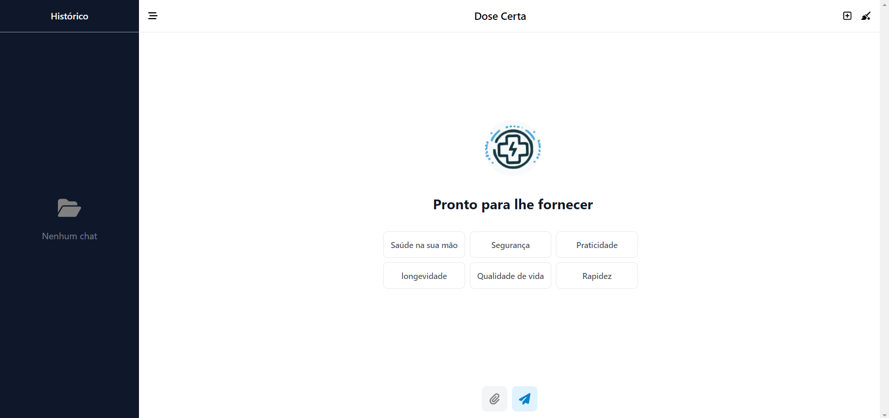

# Dose Certa
Aplicação web de IA-Generativa para receitas rápidas de medicamentos, usando a API do Gemini Pro vision


Chat para projetos da Alura com intuito de melhorar a rapidez e eficiencia em receitas e leitura de bulas para medicamentos

---

## Página inicial



## Página com resposta


## Mobile

 | 
---

Como rodar:

Na pasta raiz e na pasta frontend execute:

```shell
npm i
```

Novamente na pasta Raiz, primeiramente, e depois na pasta frontend, execute o comando:

```shell
npm start
```

---

<div align="center">
<i>Contato</i><br> 
<br>
<a href="https://www.linkedin.com/in/vinic-costa/" target="_blank"></a>
</div>
